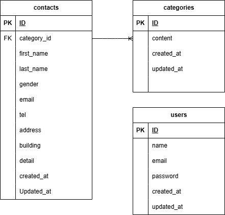

# アプリケーション名
お問い合わせフォーム

## 環境構築

### Dockerビルド
1. git clone　リンク
git@github.com:yokoda21/contact-form-test.git
2. docker-compose up -d build
*MySQLはOSによって起動しない場合があるのでそれぞれのPCに合わせてdocker-compose.ymlファイルを編集してください。

### Laravel環境構築
1. docker-compose exec php bash
2. composer install
3. env.exampleファイルから.envを作成し、環境変数を変更
4. php artisan key:generate
5. php artisan migrate
6. php artisan db:seed

## 使用技術
・PHP8.2.27
・Laravel 8.83.8
・MySQL8.2.27

## ER図

## URL
・開発環境：http://localhost/
・phpMyAdmin : http://localhost:8080/
